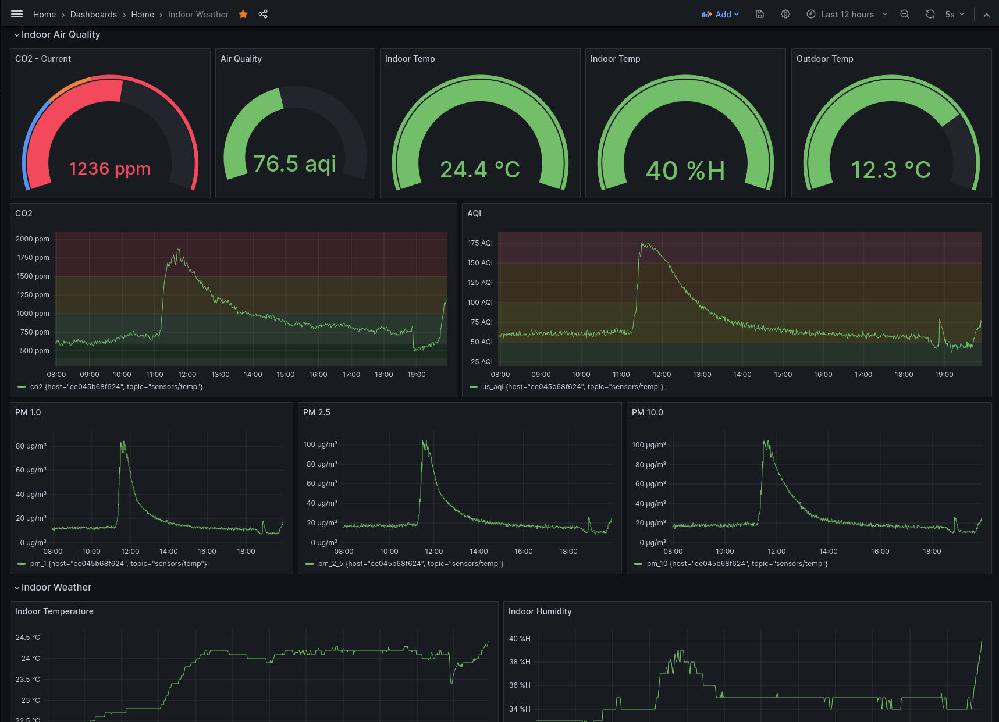
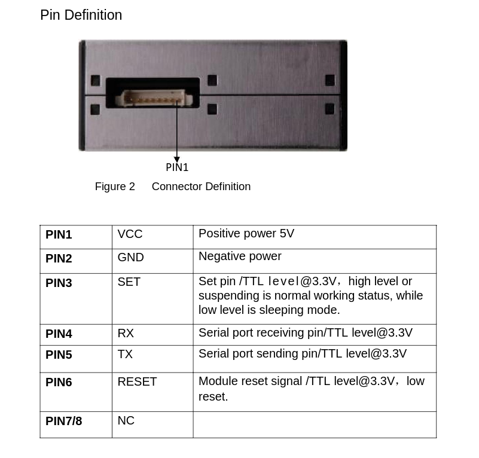
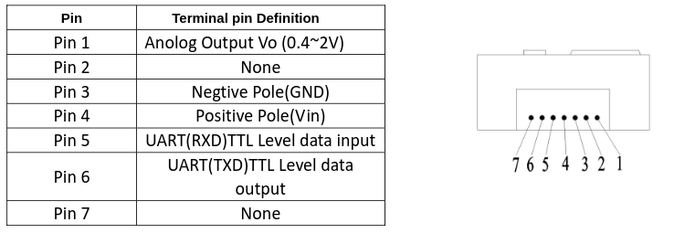
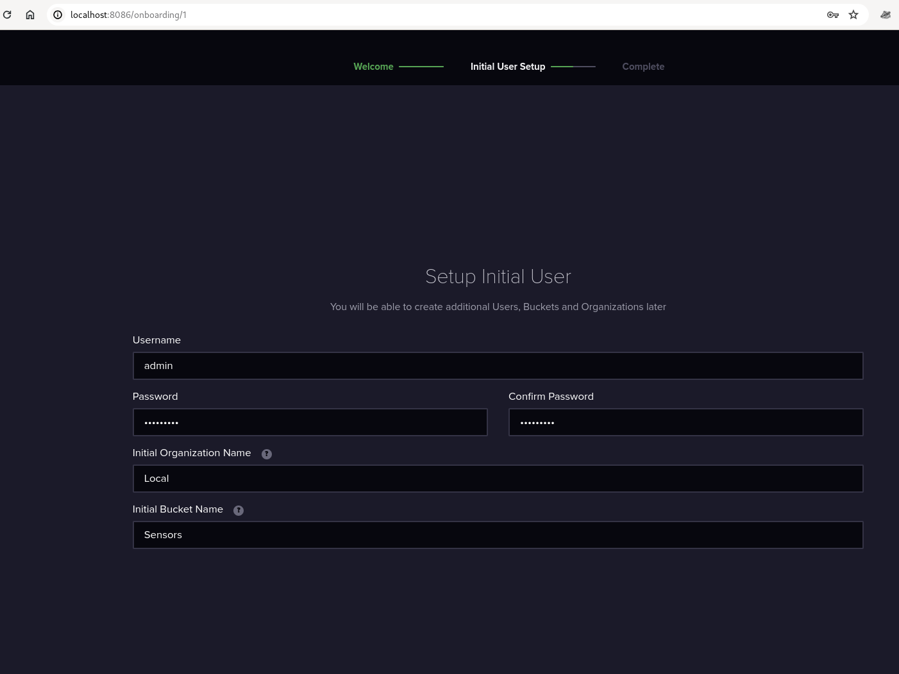
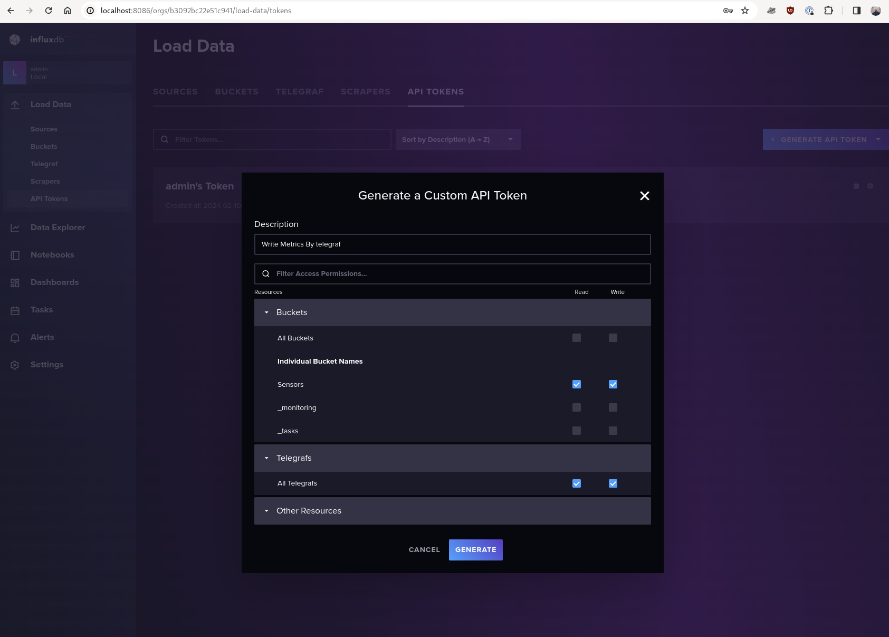

# DIY Indoor Air Quality Monitoring

Note: I am not an expert in embedded systems and microcontrollers, so please do not take anything
I did at face value, but this works for me.

## The Goal

I wanted to monitor my indoor Air Quality (Co2 and PM values) and plot the data on Grafana dashboard

This is my grafana dashboard



> Note: Lots of weekend cooking, I am not dying. The air quality is fine otherwise

## Components

- Temperature and humidity : DHT11 - This is not the best sensor, but good enough for my use case
- CO2 : MHZ19-B
- PM (Particulate Matter) : PMS5003
- Esp32 development board
- Breadboard
- Jumper Wires
- Arduino IDE


## How will it work?

1. Sensors connected to the ESP32 Dev board
2. ESP32 connected to the WiFi Network
3. MQTT server running on the same WiFi Network
4. ESP32 pushes the sensor readings periodically to MQTT server
5. We have InfluxDB, Telegraf and Grafana on the same network
6. Telegraf pushes metrics to InfluxDB
7. Grafana dashboards visualizes metrics in InfluxDB

## ESP-32 Code : Data Collection

The source code is [HERE](./esp32-code/)

### Pin Connections

We will use the serial connections for PM and CO2 sensor. Since ESP32 has three serial ports, we can use 
two of them. Leave the first one (Serial port 0) alone and use 1 and 2

#### DHT-11

Refer [THIS](https://randomnerdtutorials.com/esp32-dht11-dht22-temperature-humidity-sensor-arduino-ide/) in connecting the DHT-11 to ESP32 (Not my website, but it is very well detailed and I am too lazy to reproduce that information here)

- I used GPIO pin 21 for my dht-11

#### PM Sensor : PMS5003

Checkout the datasheet [HERE](./datasheets/plantower-pms5003-manual_v2-3.pdf). I Downloaded from [HERE](https://www.aqmd.gov/docs/default-source/aq-spec/resources-page/plantower-pms5003-manual_v2-3.pdf)

- Connect the PM sensor to one of the serial port. I used Serial port 1 (Remember, the first one is port 0)



> NOTE: Make sure you count the pins from the correct location

I used these pins
```c
const int PMS_RX = 32;
const int PMS_TX = 33;
```
That is:
- Pin 32 on the ESP32 board is connected to TX of PM sensor (Pin 5)
- Pin 33 to Pin 4
- VCC
- GND

> Note: We only need to use these 4 pins. 


#### CO2 Sensor : MH-Z19B



- I used the Serial Port 2

```c
#define CO2_TX 16
#define CO2_RX 17
#define CO2_BAUDRATE 9600
```

- VCC
- GND
- Pin 5 (TX) on the sensor to pin 17 (RX) on the esp32 board
- Pin 6 to Pin 17

### Powering it

I use the same single USB connection to the ESP32 to power everything, seems to be more
than enough

### Before running :  in the code

1. Update the WiFi SSID and Password
2. Update the MQTT broker IP, username, password and the topic name
3. Update the serial ports to appropriate values, use correct pin numbers

### Libraries Required

- https://github.com/fu-hsi/PMS
- https://github.com/plapointe6/EspMQTTClient
- https://github.com/WifWaf/MH-Z19

## Mosquitto -> InfluxDB

Checkout [THIS](./mqtt-influxdb-grafana/) directory. The docker-compose.yaml file sets up the following

- mqtt : will receive sensor data from esp32
- telegraf : will forward metrics from mqtt to influxdb2
- influxdb2 : final destination of sensor readings
- Grafana : Will come to this later

You can run `docker-compose up` from that directory and it should bring everything up.

### Setup Mosquitto

You can use the following commands to create a user and password for mosquitto

```bash
docker exec -it mqtt5 /bin/sh
mosquitto_passwd -c /mosquitto/config/pwfile <username>
chmod 0700 /mosquitto/config/pwfile
exit
```


#### Test that mosquitto connection works

After installing the `mosquitto` package on Linux (Or refer [THIS](https://mosquitto.org/download/) for other OS)

You can test that it works by first starting a subscriber using
```bash
mosquitto_sub -h localhost -t sensors/readings -u <username> -P <the password>
```

And then publish a message to the same topic
```bash
mosquitto_pub -h localhost -t sensors/readings -m "hi" -u <username> -P <the password>
```

You should see `hi` showing up on the subscriber window

### Setup InfluxDB

Open `localhost:8086` on your browser. Assuming Docker runs on your local machine, if it is on a different host, open that host's IP address:8086



> Take note of the Organization name and Bucket name because we will use this with telegraf

Once that is done:
- Go to `Load Data` -> `API Tokens` -> `Generate API Token`
- We will create a custom token that gives read/write access to `Sensors` bucket
- Generate



### Setup Telegraf

Ensure `telegraf.conf` is accurate with all the credentials.
Also make sure to update the influxdb token 

## Visualizing in Grafana

